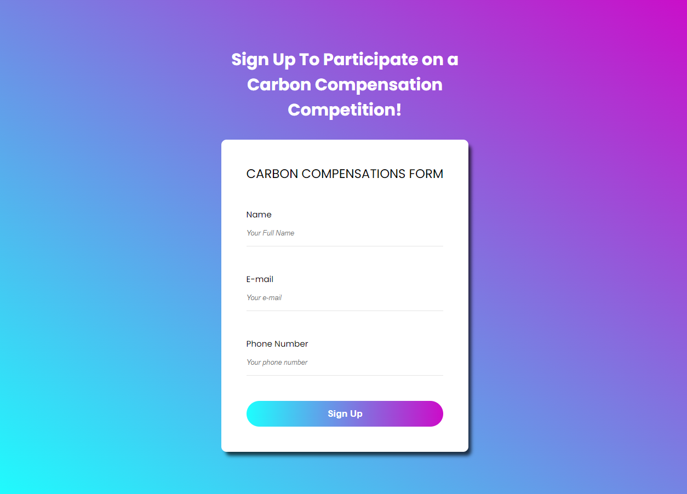
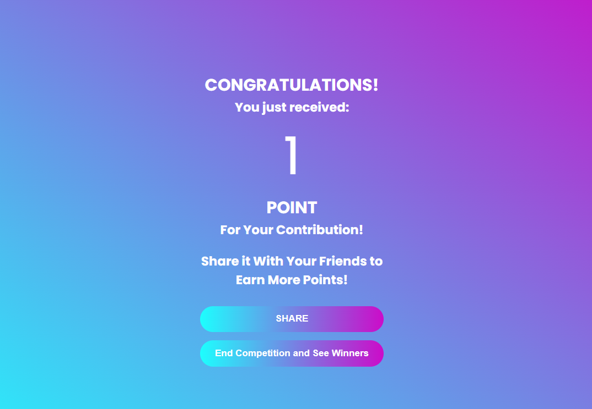
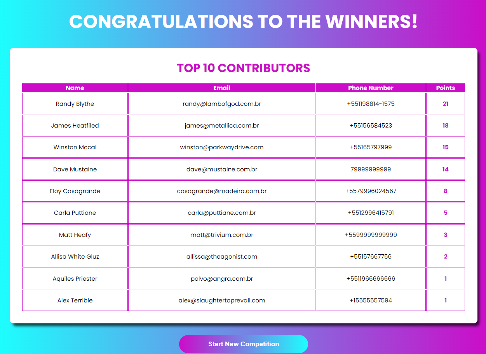

<h1>repenso-backend-challenge-webpage</h1>

Este repositório é destinado a um desafio de código proposto pela empresa Repenso. A aplicação foi desenvolvida usando ReactJs, Styled Components, TypeScript e tecnologias relaciondas.

<h2>LINK DO BACKEND NECESSÁRIO PARA RODAR A APLICAÇÃO</h2>

- https://github.com/mariojuniordev/repenso-backend-challenge-api

<h2>Solução Adotada para o Projeto</h2>

- O projeto foi desenvolvido utlizando ReactJS e NextJS com template de TypeScript;
- Por questões de agilidade e maior afinidade com a tecnologia foi utilizado Styled Components para desenvolvimento da User Interface;
- Para consumo da API foi utilizado a lib Axios;

<h2>Como Instalar as Dependências do Projeto</h2>

yarn

<h2>Como Executar o Projeto em Desenvolvimento</h2>

yarn dev

<h2>Funcionamento da Aplicação</h2>

- Ao preencher o formulário da página principal é feita uma requisição POST que salvará os dados usuário no banco e computará 1 ponto para este usuário;
- Na página de compartilhamento o usuário tem a opção de comapartilhar o seu link, que receberá como query param o e-mail deste mesmo usuário;
- Ao clicar no link referido, o novo usuário que fizer cadastro usando este link esterá gerando automaticamente 1 ponto adicional à pontução do usuário referido, é feita uma requisição POST na sequência, contabilizando um ponto extra para o usuário referido e salvando os dados no banco;
- Na página de compartilhamento o usuário pode optar por compartilhar seu link de referência ou encerrar a competição e visualizar o top 10 dos que mais pontuaram;
- Ao clicar no botão que encerra a competição é feita uma requisição GET, que irá fazer a ordenação dos usuários e mostrar os 10 que mais pontuaram;
- Na página do top 10, o botão abaixo da tabela faz uma requisição get para a API e limpa todos os usuários cadastrados na competição, iniciando uma nova competição;

<h2>IMPORTANTE LEMBRAR DE EXECUTAR O BACKEND DISPONIBILIZADO NO LINK ACIMA PARA CORRETO FUNCIONAMENTO DA APLICAÇÃO!</h2>

<h3>Requisitos Propostos pela Empresa</h3>

- Formulário de inscrição na competição;
- Botão de compartilhar;
- Quando um novo usuário fizer cadastro usando o link index do usuário referido, o usuário referido ganha 1 ponto na competição;  

